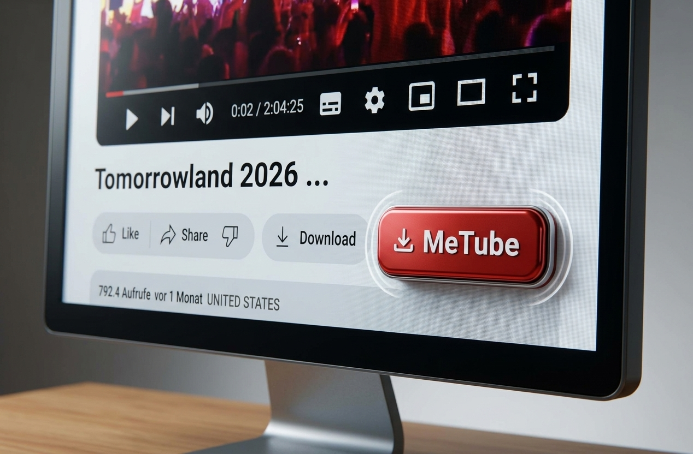

# Send to MeTube

Ein plattformübergreifendes Browser-Add-on (Manifest V3) für **Mozilla Firefox**, **Google Chrome**, **Microsoft Edge** und weitere Chromium-Browser, das einen Download-Button direkt in die YouTube-Bedienoberfläche einbettet. Ein Klick sendet die URL des aktuellen Videos automatisch an eine eigene [MeTube](https://github.com/alexta69/metube)-Instanz.



---

## 🛠️ Features

- **Cross-Browser Support**: Ein einziger Codebase-Standard für Chrome, Edge, Firefox, Brave und Opera.
- **Nahtlose Integration**: Fügt sich optisch direkt neben dem Abonnieren-Button auf YouTube ein.
- **CORS-Bypass**: Die Anfragen werden über ein Background-Script (Service Worker) abgewickelt, um Cross-Origin-Blockaden zuverlässig zu vermeiden.
- **SPA-Kompatibel**: Erkennt Seitenwechsel auf YouTube automatisch via `MutationObserver`.

---

## 📥 Installation

### 🦊 Mozilla Firefox (Dauerhafte Installation)

Für Firefox steht das von Mozilla signierte Paket bereit. Dadurch bleibt die Erweiterung auch nach jedem Browser-Neustart dauerhaft installiert:

1. Lade die Datei **`send-to-metube-latest.xpi`** herunter.
2. Öffne Firefox.
3. Ziehe die Datei `send-to-metube-latest.xpi` per **Drag & Drop** in ein beliebiges Firefox-Fenster.
4. Bestätige den Dialog mit **Hinzufügen**.
5. *(Optional)* Falls YouTube bereits geöffnet war, lade die Seite einmal mit `Strg` + `Shift` + `R` neu.

---

### 🌐 Google Chrome, Microsoft Edge, Brave & Opera (Chromium)

In Chromium-basierten Browsern wird das Add-on im Entwicklermodus installiert:

1. Klone dieses Repository oder lade es als ZIP-Archiv herunter und entpacke es.
2. Öffne die Erweiterungsverwaltung im Browser:
   - **Google Chrome:** `chrome://extensions/`
   - **Microsoft Edge:** `edge://extensions/`
   - **Brave:** `brave://extensions/`
   - **Opera:** `opera://extensions/`
3. Aktiviere oben rechts den **Entwicklermodus** (*Developer mode*).
4. Klicke auf **Entpackte Erweiterung laden** (*Load unpacked*).
5. Wähle den Projektordner aus, in dem sich die `manifest.json` befindet.

---

## ⚙️ Konfiguration

Passe bei Bedarf die Ziel-URL deiner MeTube-Instanz in der `background.js` sowie in der `manifest.json` unter `host_permissions` an:

- **MeTube-Endpoint**: `https://ytdl.marcelkoenig.de/add`

---

## 📁 Projektstruktur

```text
metube-youtube-addon/
├── manifest.json                  # Manifest V3 Konfiguration für Chromium & Firefox
├── background.js                # Background Service Worker für API-Requests (CORS Bypass)
├── content.js                   # DOM-Injection & Observer für die YouTube-Ober